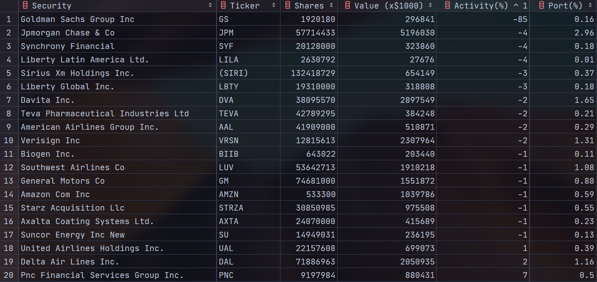
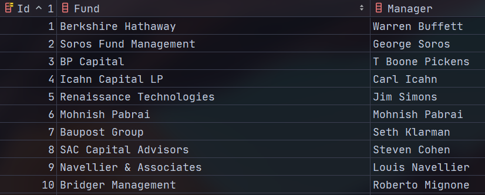

# Hedge Fund 13F Report crawler
Source: [Insider Monkey](https://www.insidermonkey.com/)

# 資料說明
總共有1239家基金，資料夾用基金名稱命名，時間從2010 Q4到2020 Q1，總共38季。
如果有基金某季缺少就是Insidermonkey上沒有資料。
標的若是選擇權或債券會在Note的欄位註上PUT, CALL或BOND。
(程式主檔案: 13f.py)

## 2020/6月止爬下的資料的Google Drive連結:
https://drive.google.com/drive/folders/1x8EacNKGGfbYOeqvqUF912HFXvSThUHK?usp=sharing

## TODO 
- fund_name.py
    1. fund capital
    2. logging
 
1. parallelism in one click
2. error log won't catch

## Error
450 Cumberland Associates / Springowl Associates
Biotechnology Value Fund / BVF Inc/Biotechnology Value Fund

